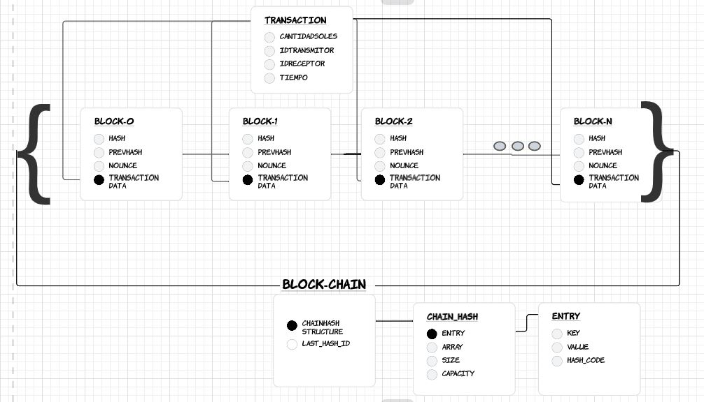

[](https://classroom.github.com/online_ide?assignment_repo_id=8855166&assignment_repo_type=AssignmentRepo)


# Introducción  
El proyecto planteado consiste en la creación una aplicación de transferencias. La aplicación tiene por nombre **Transfierete** , el objetivo es poder realizar transacciones de dinero desde un usuario a otro de manera segura. 

Como ya mencionado antes, el modelo a crear brindará la seguridad de los datos como:  
- La infomración de los usuarios  
- Los montos que se transfiere

La aplicación tendrá la seguridad de los datos:
- Información de los usuarios
- Monto transferido


# Descripción  
Para el realce del proyecto, se hace uso de la tecnología basada en BlockChain, la cual consiste en la creación de bloques enlazados, y cada bloque tendrá la información necesaria para que las transacciones se realicen de manera segura, evitando que la información sea modificada u obtenida por otros usuarios.

# Importancia  
El manejo de BlockChain a travez de bloques es sumamente importante debido a que es:

 - **No modificable**: Cada bloque depende del código encriptado del anterior, para así cuando se intente modificar algún bloque, primero se tendría que validar el anterior y así sucesivamente.
 
 - **No renocible**: La información de los usuarios que realizan la transacción permanecerá oculta a través de un código encriptado. Así cuidar la integridad de nuestros usuarios.

 - **Nueva tecnología**: La importancia aquí es que, el BlockChain puede adaptarse a nuevas tecnologias y actualemnte se considera una de las mas confiables y seguras para el transporte de información.  


# Estructuras  



# Complejidad Big O  

## Insertar  
```
string addBlock(Transaction* _data)
   {
    Block* block =  new Block(_data,LastHashId);
    LastHashId = block->generateHash();
    Structure.insert(block->getHash(), block);
    return block->getHash();
   }

```

## Buscar  
Block* getBlockByHash(string hash) //O(K)
   {
      Block* block = Structure.get(hash);
      // cout << block->   ();
            // cout << block->get_Data()->getCantidadSoles();
      return block;
      // cout << block->data << endl;
   }

## Comparación (Con índices | Sin índices)  
Mostrar tabla  

# Conclusiones  
En conclusion  

# Referencias  
Preimera ref  

