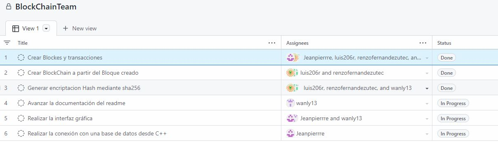
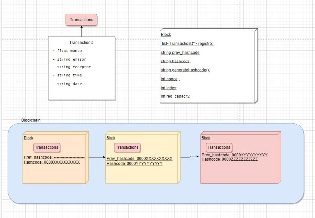

[](https://classroom.github.com/online_ide?assignment_repo_id=8855166&assignment_repo_type=AssignmentRepo)


# Introducción  
Con el paso de los años el dinero fue tomando miles de formas, desde pesados metales hasta papel con valor impreso en el. Su forma mas compacta conocida hasta la fecha es el dinero digital.

 Con el fin de explotar este concepto de la mejor forma, nuestro proyecto planteado consiste en la creación una aplicación de transferencias. La aplicación tiene por nombre *Transfierete* , el objetivo es poder realizar transacciones de dinero desde un usuario a otro de manera segura, como una alternativa segura para los usarios.  

Como ya mencionado antes, el proyecto brindará la seguridad en los siguientes datos:  

- La identidad e información de los usuarios.  
- Los montos que transfiere y recibe.


# Descripción  
Para el realce del proyecto, se hace uso de la tecnología basada en BlockChain. Esta misma consiste en la creación de bloques enlazados, y cada bloque tendrá la información necesaria para que las transacciones se realicen de manera segura, evitando así que la información sea modificada u obtenida por otros usuarios.

# Importancia  
El manejo de BlockChain a través de bloques es sumamente importante debido a que es:

 - **No modificable**: Cada bloque depende del código encriptado del anterior, para así cuando se intente modificar algún bloque, primero se tendría que validar el anterior y así sucesivamente.
 
 - **No reconocible**: La información de los usuarios que realizan la transacción permanecerá oculta a través de un código encriptado. Así cuidar la integridad de nuestros usuarios.

 - **Nueva tecnología**: La importancia aquí es que, el BlockChain puede adaptarse a nuevas tecnologías y actualmente se considera una de las mas confiables y seguras para el transporte de información.  

# Organización  
[Link de tareas asignadas](https://github.com/orgs/utec-aed-2022-2/projects/13)

Tareas Asignadas:  


# Estructuras  



DESCRIPCIÓN ESTRUCTURAS:  

- **block.h** : Contiene el registro de todas las *Transacciones*, adicionalmente contiene su *hash único* y el *hash anterior* (Ambos generados mediante una _**structura sha256**_).  
- **blockchain.h** : Contiene el registro de todas las *Transacciones*,
- **Transaction.h** : Contiene los datos de las transacciones y es conectada con cada bloque. En este apartado se puede tener mas de una transacción dentro de un bloque. 
- **sha256.h** : Se realiza el método de encriptación para la generación del Hash y prevHash.
- **md5.h** : Se usa para realizar el método de encriptación para la base de datos (PostressSQL), con el fin de tener un backup de las transacciones de forma segura e inaccesible para cualquier persona.  
- **mysql.cpp** : El archivo se encarga de realizar la conexión entre la base de datos en la nube del servicio AWS. _**(En Proceso)**_

# Conplejidad Big O  

## Insertar (BLockChain)

- Partiendo del concepto de listas enlazadas, la complejidad del insert será 
O(1), ya que se sacara el hash del ultimo bloque existente para vincularlo con el nuevo bloque el cual se insertara al inicio.
```
void insert_block ( list<TransactionD*> reg) {   
    int index = n_elements+1;                               //O(1)
    string cod;                                             //O(1)
    if(n_elements == 0){
        cod = "0";
    }
    else{
        cod = chain.front()->get_hash();                    //O(1)
    };
    Block * newBlock = new Block(index, cod, reg);          //O(1)
    chain.push_front(newBlock);                             //O(1)
    this->n_elements++;
    
    cout<<"######################################################################################"<<endl
        <<endl<<"\t\t\t\tBLOQUE NRO: "<<index<<endl<<endl
        <<"NONCE: "<<newBlock->get_nonce()<<endl
        <<"NRO TRANSACCIONES:  "<<4<<endl<<endl; 
        newBlock->show_data();
        cout<<"CODIGO HASH PREVIO: "<<newBlock->get_prev_hash()<<endl
        <<"CODIGO HASH: "<<newBlock->get_hash()<<endl<<endl
        <<"######################################################################################"<<endl<<endl;
        
};

>> Complejidad = O(1)
```
## Búsqueda del Nonce

> El método de encriptación que usamos para obtener el Hashcode se llama SHA256.
> De forma general, para obtener el código hash usamos todos los datos de la transacción, el índice del bloque, y el Código hash del bloque anterior (En caso de ser el bloque 1, el código hash previo es '0'), y posteriormente procedemos a concatenarlos en un string. Luego, iniciamos un bucle (se especifica más adelante) en donde se buscará un número(nonce) aleatorio en un rango determinado () que al concatenarse con el string previo y, al obtener el código hash de ese string (llamando a la función SHA256), se obtenga un Hashcode que inicie con 4 ceros.  

### La función SHA256(Secure Hash Algorithm of 256 bytes)

> Este algoritmo de encriptación es muy usado actualmente, y se dice que es el reemplazo del algoritmo de encriptación md5, debido a su seguridad y rapidez. No nos hemos adentrado a fondo a entender cómo funciona este algoritmo, por lo que la implementación de la función SHA256 que se usa en este proyecto no es propia. 

> La función que usamos en el proyecto retorna el código hash a partir de un conjunto de caracteres(string). Volviendo al punto anterior (inicialización del bucle), una vez que ya tenemos el Hashcode (del string con el nonce concatenado), procedemos a realizar una evaluación del primer carácter, último carácter, carácter central, y el anterior al central. Para que el código hash sea válido, verificamos que se cumplan ciertas condiciones aritméticas con el código ASCII de estos caracteres. La cantidad de condiciones y el tipo de complejidad de estas repercuten en el tiempo de búsqueda del nonce apropiado. Si aumentamos las condiciones, y si las hacemos más "complejas”, el tiempo de búsqueda aumentara considerablemente.
> Una vez encontremos el nonce apropiado, procedemos a reemplazar los primeros cuatro valores del string Hashcode con '0000', y retornamos la cadena.

## Buscar  
```
El buscar se basa en recorrer todos los block's hasta encontrar el corrercto por lo tanto la complejidad seria O(n)

void BlockChain::find(string hashcode){

    for(auto &it: chain){                               //O(n)
        if(it->get_hash()==hashcode){                   //O(1)
            cout<<endl<<"Se encontro el bloque..."<<endl;
            cout<<"######################################################################################"<<endl
            <<endl<<"\t\t\t\tBLOQUE NRO: "<<it->get_index()<<endl<<endl         //O(1)
            <<"NONCE: "<<it->get_nonce()<<endl                                  //O(1)
            <<"NRO TRANSACCIONES:  "<<4<<endl<<endl; 
            it->show_data();                                                    //O(1)
            cout<<"CODIGO HASH PREVIO: "<<it->get_prev_hash()<<endl             //O(1)
            <<"CODIGO HASH: "<<it->get_hash()<<endl<<endl                       //O(1)
            <<"######################################################################################"<<endl<<endl;
            return;
        } 
    }
    cout<<"No se encontro el bloque...\n";
}

>> Complejidad = O(n)

```  

# Comparación (Con índices | Sin índices)  
_**En proceso**_  

# Conclusión
En conclusión la tecnología del BLockChain tiene la posibilidad de brindar la confidencialidad de nuestros usuarios y así mismo puede brindar la seguridad de cada uno de los datos. Esta tecnología puede llegar a ser la nueva alternativa que muchos usuarios obtarian ya que puede ser usado en distintas ramas ya sea legales, sociales, financieras y entre otros. 


# Referencias  

- ¿QUÉ es y CÓMO funciona el BLOCKCHAIN? en 6 MINUTOS. TIENES QUE SABERLO ¡YA! 📖💰. (2018, 28 marzo). [Vídeo]. YouTube. Recuperado 17 de octubre de 2022, de https://www.youtube.com/watch?v=C5NZnD12yjg  

- Los Beneficios del Blockchain. (2022, 11 agosto). Campus Internacional de Blockchain. Recuperado 17 de octubre de 2022, de https://www.campusblockchain.es/los-beneficios-del-blockchain/  

- MD5 Implementation in C++ - Programming Algorithms. (2015, 11 septiembre). Recuperado 17 de octubre de 2022, de https://www.programmingalgorithms.com/algorithm/md5/cpp/  
